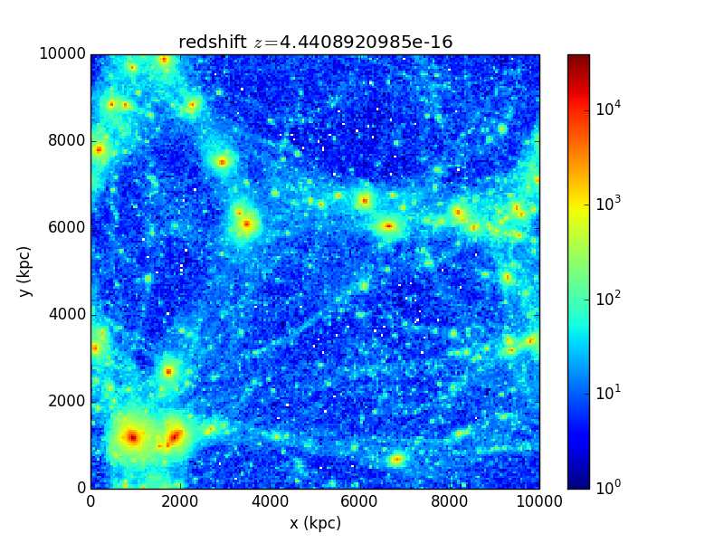

# N-body-simulations

---

***INITIAL CONDITIONS***
C-codes for Eddington and Osipkov-Merritt structures, provided by Martin Sparre 
DENSITY PROFILES: 
Hernquist and Tsallis q-fit  

***SIMULATIONS***
Performed with GADGET-2. 

***TYPES***
G-perturbations 
Energy-perturbations  

***ANALYSIS***
Python algorithms 

***BINNING***
Radial bins 
velocity bins 
Mass bins (implemented as number bins)  

***AIM OF THIS PROJECT***
To reproduce the Dark matter attractor shown by Steen Hansen et. al.
